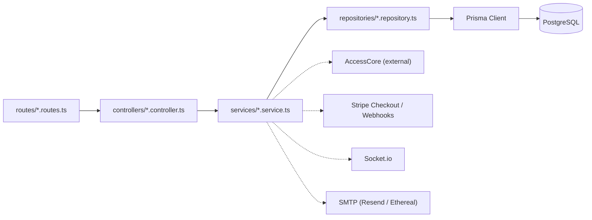
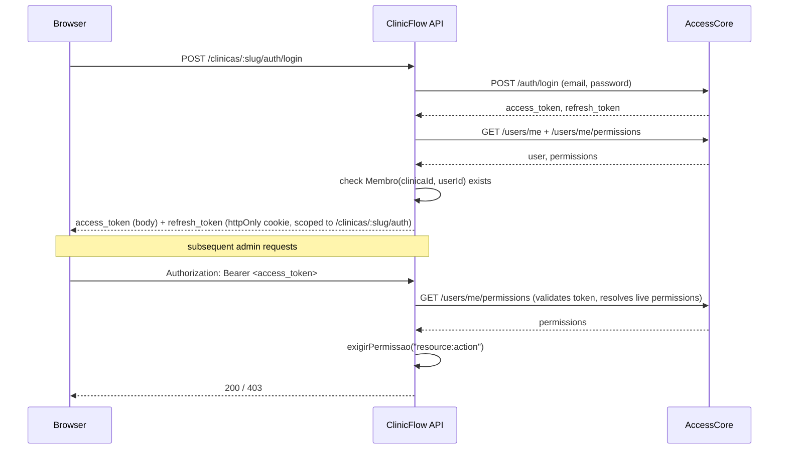

# Architecture

## Layers

ClinicFlow follows a strict layered architecture: **routes → controllers → services →
repositories → Prisma → PostgreSQL**. Each layer only talks to the one directly below it.

- **routes/** — maps an HTTP method + path to a controller function. No logic beyond wiring
  middleware (auth, rate limiting) to the right handler.
- **controllers/** — translates HTTP ↔ domain. Parses/validates the request (via Zod schemas),
  calls exactly one service method, shapes the HTTP response. No business logic and no direct
  database access.
- **services/** — where the business rules live (e.g. "a reservation locks the slot before payment
  is confirmed", "a failed checkout releases the slot immediately"). Services orchestrate one or
  more repositories and external clients (Stripe, AccessCore, email, Socket.io); they never import
  Express types.
- **repositories/** — the only layer that imports the Prisma client. Every method is scoped to a
  `clinicaId` where the underlying table has one — this is where multi-tenant isolation is
  physically enforced, not just assumed by convention.

## Why this shape

- **Testability.** Services can be tested against a real database with external dependencies
  (AccessCore, Stripe, email) mocked at the module boundary — see `tests/`. No layer needs a mock
  of the layer below it, only of what's genuinely external.
- **Multi-tenancy as a structural guarantee, not a convention.** Because repositories are the only
  layer touching Prisma, and every repository method takes `clinicaId` as a required parameter,
  it's structurally difficult to accidentally write a query that leaks across tenants — the
  compiler enforces the parameter is passed, even if a future contributor doesn't think about
  tenancy at all.
- **External integrations are replaceable.** `accessCoreClient.ts`, `stripeClient.ts` and
  `emailService.ts` are thin, isolated modules — swapping AccessCore for another identity
  provider, or Stripe for another payment processor, touches one file each, not the services that
  use them (their public interface stays the same).

## Multi-tenancy

Every business route lives under `/clinicas/:clinicaSlug/...`. The `resolveClinica` middleware
resolves the slug to a real `Clinica` row (404 if it doesn't exist) and attaches `req.clinica` —
everything downstream receives an already-validated `clinicaId`, never a raw slug string.

The link between an AccessCore user and a clinic (`Membro`) lives entirely in this database.
AccessCore has no concept of "clinic" — that tenant boundary is this service's responsibility
alone, keeping the identity provider generic and reusable across unrelated projects.

## Authentication flow

Authentication and RBAC are fully delegated to [AccessCore](https://github.com/lucafurtado/accesscore),
an external identity service. This codebase never validates a password or decodes a JWT locally.

Two consequences of this design worth calling out:

1. **Permissions are always live.** Because every admin request re-resolves permissions against
   AccessCore (rather than trusting claims baked into the access token), revoking a role takes
   effect on the very next request — no waiting for a token to expire.
2. **A valid AccessCore login is not enough.** A user can be perfectly authenticated and still get
   `403` if they aren't a `Membro` of _this_ clinic — authentication and tenant authorization are
   two separate checks, deliberately.

## Payment flow

See the [README's Payments section](../README.md#payments) for the full
reserve → checkout → webhook → confirm/release sequence, including the idempotency guarantee and
the fix for the "orphaned reservation on checkout failure" edge case.
